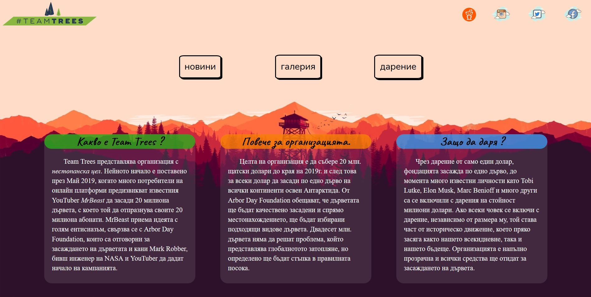
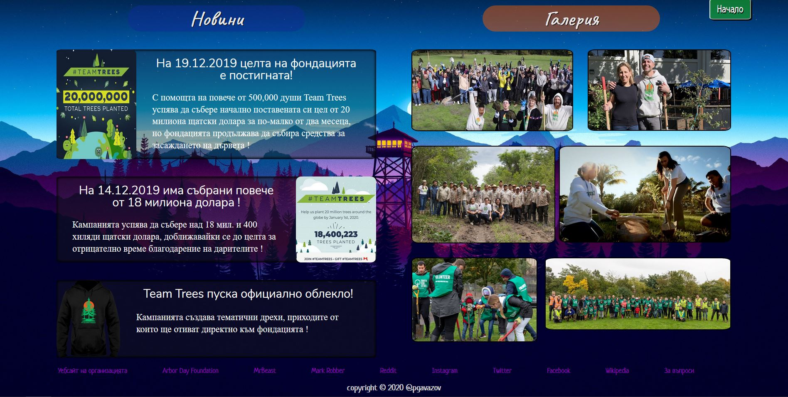

# teamtrees.free.bg
Bulgarian version of the website **teamtrees.org**, which was created as a corsework for the course Web Technologies. The purpose of the project is promote the nonprofit organization and it's cause.

## 🌱 Introduction:
- The first part of the website contains information about the organization and it's creators. From here you can learn more about the cause and how the funds from the donations are managed. The introductory part also contains navitagion for the page and a link to the official website.

## 🌲 Second Part:
- The second part of the page is split between the news and the gallery. The news sections contains news about the organization and milestones which have been reached. The gallery is home to pictures from both the cause and alike events from around the world, which the user can use as links to read more about the tree planting events.

